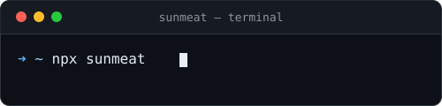

<p align="center">
  
</p>

<p align="center">
  <a href="https://github.com/sunmeat">
    
  </a>
</p>

<div align="center">


</div>

---


## 𝐇𝐞𝐥𝐥𝐨, 𝐟𝐞𝐥𝐥𝐨𝐰 <𝚌𝚘𝚍𝚎𝚛 />! 
<p align="left">
  <a href="https://www.linkedin.com/in/sunmeat/">
    
  </a>
  <a href="https://sunmeat.shop/">
    
  </a>
</p>

👇 Hit in your console or terminal to connect with me:
<p align="left">
  
</p>

[](https://www.npmjs.com/package/sunmeat)
[](https://www.npmjs.com/package/sunmeat)

<br>

```yaml
nickname: sunmeat
role: Software Engineer & Lecturer
focus: Full-Stack, Mobile & Systems Development
experience:
  - 19+ years teaching software engineering
  - 20+ contact hours/week
  - Production development on the side

languages:
  - C++        → performance-critical & systems programming
  - C#         → .NET ecosystem & enterprise solutions
  - Python     → automation, backend & data pipelines
  - Java       → enterprise systems & Android
  - JS / TS    → type-safe fullstack web development
  - Kotlin     → modern native Android
  - SQL        → data modeling & query optimization
  - PHP        → server-side web systems

skills:
  mobile:
    - Kotlin / Jetpack Compose
    - Material Design 3
    - Clean Architecture
    - MVI / MVVM
    - Coroutines / Flow
    - Hilt / Koin (Dependency Injection)
    - Room / DataStore
    - Navigation Compose
    - WorkManager
    - CameraX / ML Kit
    - Firebase (Auth, Firestore, Crashlytics)
    - Play Store deployment & release management
    - .Net MAUI :)

  backend:
    - ASP.NET Core / Node.js
    - Spring Boot / Django / FastAPI
    - EF Core / Dapper
    - RESTful API design & versioning
    - Authentication & Authorization (JWT, OAuth2)
    - Message queues (RabbitMQ / Kafka)
    - Caching strategies (Redis)
    - Background jobs & schedulers
    - Logging & structured error handling
    - API documentation (Swagger / OpenAPI)

  frontend:
    - React / Angular / Blazor
    - Electron.js
    - SPA & SSR architecture
    - State management (Redux / Zustand / Context API)
    - Component-driven development
    - Responsive & accessible UI (WCAG basics)
    - REST/GraphQL API integration
    - Build tooling (Vite / Webpack)
    - TypeScript-first development

  databases:
    - PostgreSQL / SQL Server / Oracle
    - MongoDB / Firebase / Redis
    - SQLite / Room
    - Database design & normalization
    - Query optimization & indexing
    - Migrations (EF Core Migrations)
    - Transactions & data consistency

  quality:
    - Unit / Integration testing (xUnit, JUnit, pytest)
    - TDD practices
    - Code review culture

  infrastructure:
    - Docker / CI/CD (GitHub Actions)
    - Cloud deployment (Azure / AWS / Render / Vercel / Netlify)
    - Monitoring & observability (logging, health checks)
    - Environment configuration & secrets management
    - Version control workflows (Git branching strategies)

  ai_ecosystem:
    - LLM API integration (Anthropic, OpenAI)
    - Prompt engineering
    - RAG-based assistants

highlights:
  - Designed and taught 30+ courses across C++, C#, Java, Python & web development,
from first-year fundamentals to industry-ready practice
  - Mentored 1000+ students over 19 years; multiple graduates now working at product companies
  - Built and maintained a full curriculum pipeline - lecture materials, labs, grading automation,
and internal tooling for course management
  - Balanced a ~20-classes/week teaching load with active hands-on development -
kept technical skills current across mobile, web & backend
  - Regularly updated course content to track industry shifts
(e.g. migrating curriculum from Java-only Android to Kotlin & Jetpack Compose)

```

<br clear="right"/>

---

## 🚀 Tech Stack

<h3 align="left">Languages</h3>
<p align="left">
  
</p>

<h3 align="left">Frameworks & Libraries</h3>
<p align="left">
  
</p>

<h3 align="left">Tools & Platforms</h3>
<p align="left">
  
</p>

---

## 🎹 A Little More About Me


<br/>

<p align="center">
When I'm not writing code or teaching, you'll find me:<br/><br/>
🌿 <b>Gardening</b> — tending plants with the same patience I apply to debugging<br/>
🪙 <b>Coin Collecting</b> — history in the palm of your hand<br/>
🎲 <b>Board Games</b> — strategy on the table, not just in code<br/>
🎨 <b>Acrylic Painting</b> — creative chaos, proudly committed<br/>
🎤 <b>Karaoke</b> — because syntax errors don't exist in song<br/>
🎵 <b>Music</b> — accordion · piano · melodica · sopilka · flute · drymba · kalimba · ukulele · guitar
</p>

<br/>

<p align="center">
  <a href="https://www.duolingo.com/profile/taemnus">
    
  </a>
</p>

<p align="center">
  <a href="https://duome.eu/taemnus">
    
  </a>
</p>

<br/>

---

## 💻 Weekly Coding Activity

<!--START_SECTION:waka-->


**I'm an Early 🐤** 

```text
🌞 Morning                223 commits         ███░░░░░░░░░░░░░░░░░░░░░░   13.75 % 
🌆 Daytime                1146 commits        ██████████████████░░░░░░░   70.65 % 
🌃 Evening                253 commits         ████░░░░░░░░░░░░░░░░░░░░░   15.60 % 
🌙 Night                  0 commits           ░░░░░░░░░░░░░░░░░░░░░░░░░   00.00 % 
```
📅 **I'm Most Productive on Thursday** 

```text
Monday                   239 commits         ████░░░░░░░░░░░░░░░░░░░░░   14.73 % 
Tuesday                  296 commits         █████░░░░░░░░░░░░░░░░░░░░   18.25 % 
Wednesday                282 commits         ████░░░░░░░░░░░░░░░░░░░░░   17.39 % 
Thursday                 298 commits         █████░░░░░░░░░░░░░░░░░░░░   18.37 % 
Friday                   181 commits         ███░░░░░░░░░░░░░░░░░░░░░░   11.16 % 
Saturday                 90 commits          █░░░░░░░░░░░░░░░░░░░░░░░░   05.55 % 
Sunday                   236 commits         ████░░░░░░░░░░░░░░░░░░░░░   14.55 % 
```


📊 **This Week I Spent My Time On** 

```text
💬 Programming Languages: 
C#                       3 hrs 52 mins       ██████████████░░░░░░░░░░░   55.22 % 
TypeScript               1 hr 12 mins        ████░░░░░░░░░░░░░░░░░░░░░   17.11 % 
Binary                   50 mins             ███░░░░░░░░░░░░░░░░░░░░░░   11.98 % 
JSON                     40 mins             ██░░░░░░░░░░░░░░░░░░░░░░░   09.50 % 
TSConfig                 18 mins             █░░░░░░░░░░░░░░░░░░░░░░░░   04.41 % 

🔥 Editors: 
Visual Studio            5 hrs 25 mins       ███████████████████░░░░░░   77.24 % 
WebStorm                 1 hr 31 mins        █████░░░░░░░░░░░░░░░░░░░░   21.80 % 
Notepad++                4 mins              ░░░░░░░░░░░░░░░░░░░░░░░░░   00.96 % 
```

🤖 **AI Coding This Week** 

```text
No AI Coding Activity Tracked This Week
```

**I Mostly Code in C++** 

```text
C#                       117 repos           ███████░░░░░░░░░░░░░░░░░░   29.62 % 
JavaScript               35 repos            ██░░░░░░░░░░░░░░░░░░░░░░░   08.86 % 
Python                   18 repos            █░░░░░░░░░░░░░░░░░░░░░░░░   04.56 % 
CSS                      13 repos            █░░░░░░░░░░░░░░░░░░░░░░░░   03.29 % 
TypeScript               10 repos            █░░░░░░░░░░░░░░░░░░░░░░░░   02.53 % 
```


 Last Updated on 05/09/2026 22:41:30 UTC
<!--END_SECTION:waka-->
---

## 📊 GitHub Stats

<p align="center">
  
</p>

---

## 📈 Full Metrics

<p align="center">
  
</p>

---

## 📡 Activity Graph

<p align="center">
  
</p>

---

<p align="center">
  <picture>
    <source media="(prefers-color-scheme: dark)" 
            srcset="https://raw.githubusercontent.com/sunmeat/sunmeat/snake-output/github-contribution-grid-snake-dark.svg">
    <source media="(prefers-color-scheme: light)" 
            srcset="https://raw.githubusercontent.com/sunmeat/sunmeat/snake-output/github-contribution-grid-snake.svg">
    
  </picture>
</p>

<p align="center">
  <picture>
    <source media="(prefers-color-scheme: dark)" 
            srcset="https://raw.githubusercontent.com/sunmeat/sunmeat/pacman-output/pacman-contribution-graph-dark.svg">
    <source media="(prefers-color-scheme: light)" 
            srcset="https://raw.githubusercontent.com/sunmeat/sunmeat/pacman-output/pacman-contribution-graph.svg">
    
  </picture>
</p>

<p align="center">
  
</p>
<p align="center">
  <sub>🌍 Top visitor countries (flags) — updates in real-time</sub>
</p>

<p align="center">
  
</p>

<p align="center">
  <i>"The best error message is the one that never shows up."</i><br/>
  <sub>— Thomas Fuchs (and every lecturer ever)</sub>
</p>
